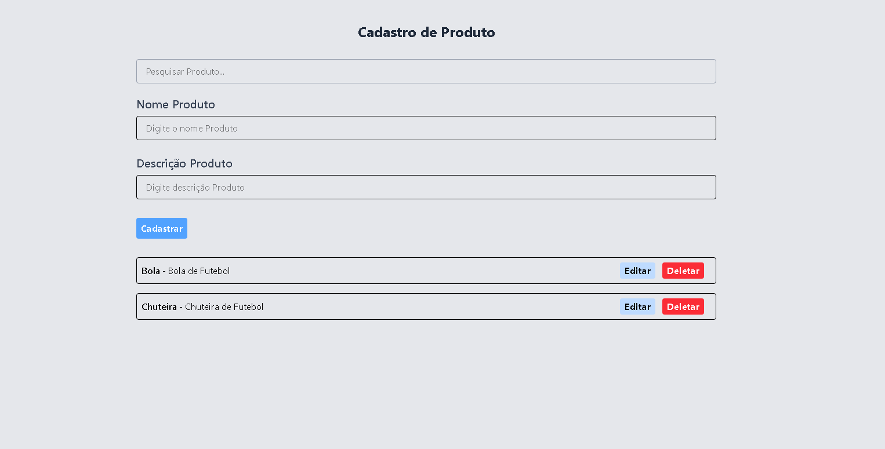

# Sistema de Cadastro de Produtos

Este é um projeto simples de CRUD (Create, Read, Update, Delete) para gerenciar um cadastro de produtos. A aplicação permite listar, pesquisar, adicionar, editar e excluir produtos, com todas as alterações sendo salvas e refletidas em tempo real.

O projeto utiliza um arquivo local `produtos.json` que funciona como um banco de dados para garantir a persistência das informações.

---
## Imagem do Projeto



---

## ✨ Funcionalidades

-   **Criar Produtos:** Adicionar novos produtos fornecendo um nome e uma descrição.
-   **Listar e Pesquisar Produtos:** Visualizar todos os produtos cadastrados em uma lista e pesquisar por um produto específico em tempo real.
-   **Editar Produtos:** Atualizar o nome e/ou a descrição de um produto já existente.
-   **Excluir Produtos:** Remover permanentemente um produto do cadastro.
-   **Persistência de Dados:** Todas as operações são salvas no arquivo `produtos.json`, garantindo que os dados não sejam perdidos ao recarregar a aplicação.

---

## 💾 Banco de Dados (`produtos.json`)

O projeto utiliza um arquivo `produtos.json` como banco de dados para armazenar a lista de produtos. A estrutura de cada produto no arquivo segue o formato abaixo:

```json
[
  {
    "id": "uuid-gerado-automaticamente",
    "nome": "Nome do Produto",
    "descricao": "Descrição detalhada do produto."
  }
]
```
---

## 🚀 Tecnologias Utilizadas

-   **Frontend:**
    -   [React.js] com [Vite]
    -   [Tailwind CSS] para estilização
    -   [React Router Dom] para as rotas
    -   [Axios] para as requisições HTTP
    -   [Phosphor React] para os ícones
-   **Backend (Simulado):**
    -   [JSON Server]

